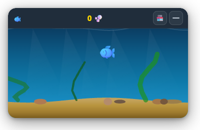

# 🐟 Desktop Fish Tank

A lightweight desktop idle fish-keeping game, inspired by idle/desktop companion games like *TBH*, *Banana*, and *Rusty's Retirement*.

## 📸 Preview



## ✨ Features

- 🐠 **8 Fish Species**: From clownfish to baby whale — pricier fish earn coins faster
- 🫧 **Click Bubbles**: Fish blow bubbles — click to collect bubble coins
- ⏱️ **Fully Idle**: Fish swim and earn coins automatically, even when you're away
- 💰 **Offline Earnings**: When you return, your fish have been hard at work (up to 8 hours accumulated)
- 💾 **Auto Save**: Saves every 30 seconds, also on page close
- 🎨 **Beautiful Rendering**: Water ripples, light rays, seaweed, pebbles, particle effects
- 🏪 **Fish Shop**: Buy new species with your bubble coins

## 🚀 Quick Start

### Option 1: Run in Browser

Just open `index.html` in any browser!

### Option 2: Electron Desktop App

```bash
# Install dependencies
npm install

# Run in development
npm run dev

# Package for Windows
npm run dist:win
```

## 🎮 Controls

| Action | Description |
|--------|-------------|
| Click bubbles | Collect bubble coins |
| Press S | Open/close fish shop |
| Right-click canvas | Reset game data |

## 🐟 Fish Catalog

| Species | Price | Coin Rate |
|---------|-------|-----------|
| 🐟 Clownfish | Free | 1.8 /min |
| 🐠 Tropical Fish | 80 🫧 | 3.6 /min |
| 🐡 Pufferfish | 250 🫧 | 9 /min |
| 🦑 Squid | 600 🫧 | 18 /min |
| 🦈 Mini Shark | 1,500 🫧 | 42 /min |
| 🐙 Octopus | 3,500 🫧 | 90 /min |
| 🐬 Dolphin | 8,000 🫧 | 180 /min |
| 🐳 Baby Whale | 20,000 🫧 | 420 /min |

## 🏗 Tech Stack

- Pure frontend: HTML + CSS + JavaScript (Canvas 2D)
- Desktop wrapper: Electron
- Storage: localStorage

## 📁 Project Structure

```
banana2/
├── index.html      # Main page
├── style.css       # Styles (glassmorphism UI)
├── app.js          # Core game logic
├── main.js         # Electron main process
├── preload.js      # Electron preload
├── package.json    # Project config
└── README.md       # Documentation (Chinese)
└── README_EN.md    # Documentation (English)
```
